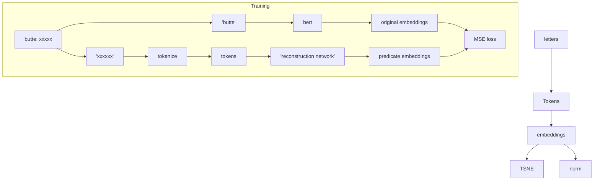
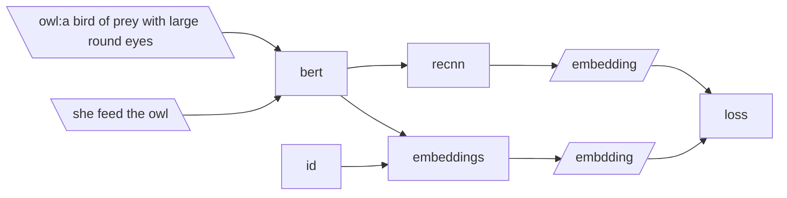

# clever_nlp

# Pipeline

```mermaid
graph TD
subgraph Training
words["butte: xxxxx"] --> word['butte']
word --> bert --> ori["original embeddings"]
words --> definiton['xxxxxx']
definiton --> tokenize --> tokens
tokens --> Recnn['reconstruction network']
Recnn --> pred["predicate embeddings"]
ori-->loss["MSE loss"]
pred-->loss
end
letters --> Tokens --> embeddings --> TSNE
embeddings --> norm
```

# Model

```mermaid
graph LR
s[\"she feed the owl"\] --> b[bert] --> e[embeddings] 
i[id] --> e --> emb[/embdding/] --> l[loss]
ex[\owl:a bird of prey with large round eyes\] --> b --> r[recnn] --> em[/embedding/] --> l
```
